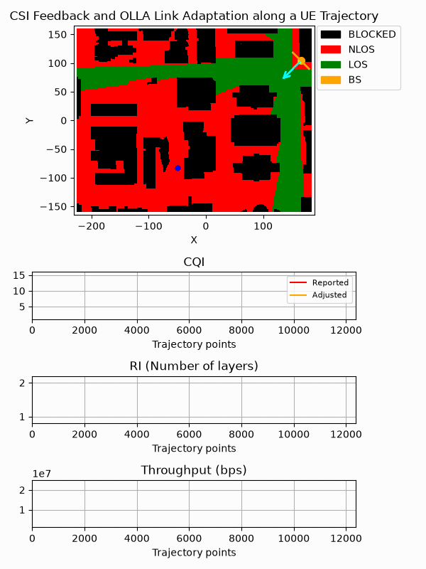

**NeoRadium** is a Python library for simulating end-to-end wireless communication systems based on the latest **3GPP 5G NR** standards. Its object-oriented design abstracts much of the complexity involved in physical-layer modeling, enabling researchers and engineers to rapidly build, customize, and evaluate communication pipelines using standard Python workflows.



In many wireless communication projects, the primary focus is a specific component of the physical layer, such as channel estimation, equalization, precoding, beam management, scheduling, or channel coding. Implementing an entire standards-compliant communication pipeline simply to evaluate a single algorithm can be time-consuming and error-prone. **NeoRadium** addresses this challenge by providing a comprehensive 3GPP-based simulation framework that allows researchers to focus on the components they care about while leveraging a complete, interoperable end-to-end system.

**NeoRadium** is designed to run on standard desktop and laptop computers without requiring specialized hardware, complex software stacks, or GPUs. If your system supports Python 3.9 or later, you can start exploring and developing communication-system simulations immediately.

The project includes a comprehensive **Playground** containing numerous tutorials and examples presented as **Jupyter Notebooks**. These notebooks demonstrate key APIs, explain core concepts, and provide practical examples ranging from basic resource-grid operations to complete end-to-end 5G NR simulations.

## Documentation

* [Installation Guide](https://interdigitalinc.github.io/NeoRadium/html/source/installation.html)
* [Documentation Home](https://interdigitalinc.github.io/NeoRadium/html/index.html)
* [Playground](https://interdigitalinc.github.io/NeoRadium/html/source/Playground/Playground.html)

## The Playground

The **Playground** directory contains a collection of tutorial notebooks covering the major **NeoRadium** modules and workflows. To run these examples, start a [Jupyter Notebook](https://jupyter.org) server and open the notebooks in your web browser.

The tutorials range from introductory examples to advanced end-to-end simulations and provide a practical way to learn **NeoRadium**'s APIs and capabilities.

## Citation
If you use **NeoRadium** in your work, please cite it as:

```bibtex
@software{Id_AILAB_NeoRadium_2026,
  author  = {Hamidi-Rad, Shahab},
  title   = {NeoRadium},
  version = {0.5.1},
  year    = {2026},
  month   = {August},
  url     = {https://github.com/InterDigitalInc/NeoRadium}
}
```
