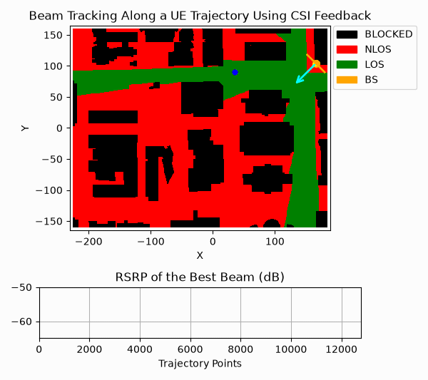

.. neoradium documentation master file.

.. role:: red

What is NeoRadium?
==================

**NeoRadium** is a Python library for simulating physical-layer communication pipelines based on the latest **3GPP 5G NR** standards. Its object-oriented design abstracts much of the complexity of the underlying communication chain, making it easier to build, run, and analyze end-to-end simulations on standard computing hardware.

In wireless communication research, it is often necessary to evaluate a specific block within a larger pipeline, such as channel estimation, equalization, or CSI feedback. Building a complete 3GPP-compliant simulation environment from scratch for that purpose can be time-consuming and difficult to maintain. **NeoRadium** addresses this problem by providing a comprehensive end-to-end framework that researchers can readily customize and extend for their own work.

With **NeoRadium**, users can focus on developing and evaluating new algorithms rather than re-implementing the surrounding infrastructure. No specialized hardware, complex system setup, or GPU resources are required. A standard computer with Python 3.10 or later is sufficient to get started.

**NeoRadium** also includes a comprehensive :doc:`source/Playground/Playground` with many practical examples. These examples are provided as `Jupyter Notebooks <https://jupyter.org>`_ and demonstrate both the API and common usage patterns in realistic scenarios.

Key Features
============

**NeoRadium** provides a broad set of tools for 5G NR physical-layer research and development. The current release includes the following capabilities, with additional functionality continuing to be added over time.

* **Channel Coding**: Transport block encoding and decoding using Polar and LDPC codes in accordance with TS 38.212.
* **Carriers and Bandwidth Parts**: Timing calculations for cyclic prefix, OFDM symbols, slots, subframes, and frames.
* **Reference Signal Generation**: Support for DM-RS, PT-RS, and CSI-RS generation according to TS 38.211, TS 38.212, and TS 38.214.
* **Resource Grid Functionality**: Resource mapping and OFDM modulation aligned with TS 38.101, TS 38.104, and TS 38.211.
* **Resource Grid Visualization**: Visualization tools for inspecting resource-grid contents.
* **PDSCH Communication Pipeline**: End-to-end PDSCH simulation including modulation and demodulation, mapping and demapping, interleaving and de-interleaving, scrambling and descrambling, transport block size calculation, precoding, channel estimation, and equalization in accordance with TS 38.211 and TS 38.214.
* **Antenna Array Modeling and Simulation**: Based on TR 38.901.
* **Antenna Field Analysis**: Calculation of antenna field power and directivity, with 2D and 3D visualization.
* **Channel Modeling**: Application of CDL and TDL channel models to both time-domain and frequency-domain signals.
* **DeepMIMO Integration**: Import of DeepMIMO ray-tracing scenarios for building user trajectories.
* **Trajectory-Based Channel Models**: Generation of spatially and temporally consistent channel sequences based on user trajectories for end-to-end simulations.
* **Channel Datasets**: Creation of channel-matrix datasets using CDL models or temporally and spatially consistent sequences of channel matrices derived from DeepMIMO trajectories.
* **HARQ**: Support for Hybrid Automatic Repeat reQuest (HARQ).
* **CSI Feedback Simulation** :red:`(New)`: Including CSI-RS and CDI report configuration, as well as CRI, RI, PMI, and CQI calculation.
* **Link adaptation** :red:`(New)`: An outer loop link adaptation (OLLA), which can be used as a lightweight link adaptation algorithm for illustrative and simulation-oriented workflows.
* **CQI Lookup Tables** :red:`(New)`: Using Exponential Effective SINR Mapping (EESM), pre-calibrated AWGN SNR-BLER curves, and beta and delta lookup tables for CQI reporting.
* **Beam Sweeping and Probing** :red:`(New)`: Creation of beam-sweeping and beam-probing CSI-RS resources and associated CSI reports.

Changes in Version 0.5.0
========================

Version 0.5.0 introduces major API improvements and internal restructuring in **NeoRadium**. Although most previously available functionality remains supported, users are strongly encouraged to update existing code to the newer APIs for improved clarity, performance, and long-term compatibility.

Please refer to the :doc:`Migration Guide <source/MigrationGuide>` for a summary of the required changes.

.. toctree::
   :hidden:

   self

.. toctree::
   :hidden:
   :maxdepth: 3
   :caption: Getting Started

   source/installation
   source/MigrationGuide
   source/Playground/Playground

.. toctree::
   :hidden:
   :maxdepth: 3
   :caption: API

   source/API/Carrier
   source/API/Grid
   source/API/Waveform
   source/API/Modulation
   source/API/RefSig
   source/API/CsiReport
   source/API/PhyChannels
   source/API/ChanCode
   source/API/Harq
   source/API/Antenna
   source/API/Channels
   source/API/Random
   source/API/DeepMIMO
   source/API/SnrHelper
   source/API/Utilities

Indices
=======

* :ref:`genindex`
* :ref:`modindex`
