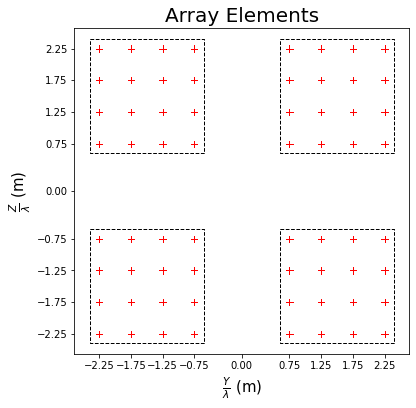
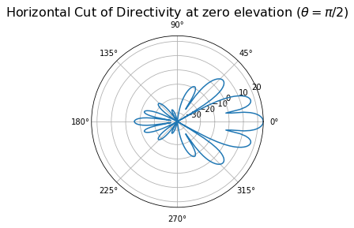

Antenna
=======
**NeoRadium** supports the antenna elements, panels, and arrays as defined in the 3-GPP standard **TR 38.901**. Using this API, you can easily create antenna arrays and study their charactristics.

**Example**

.. code-block:: python
        
    elementTemplate = AntennaElement(beamWidth=[65,65], maxAttenuation=30)
    panelTemplate = AntennaPanel([4,4], elements=elementTemplate, polarization="+")
    antennaArray = AntennaArray([2,2], spacing=[3,3], panels=panelTemplate)
    antennaArray.showElements(zeroTicks=True)

.. code-block::
        
    antennaArray.drawRadiation(theta=90, radiationType="Directivity", normalize=False)

.. automodule:: neoradium.antenna
   :members: AntennaBase, AntennaElement, AntennaPanel, AntennaArray
   :member-order: bysource
   :special-members:
   :exclude-members: __init__, __repr__, __weakref__, __dict__, __getitem__, seqParams
